# Challenge

## Respuestas a las preguntas

1. Diferencia entre interfaz y clase abstracta.

**Respuesta**:

En términos generales de OOP

**Una interfaz** es una clase totalmente abstracta, no contiene ni un solo método implementado y su utilidad principal es definir el comportamiento de clases que la implementen, permite homologar el comportamiento de varias clases concretas por ejemplo para el principio de Inyección de dependencia puede que haya varias clases concretas que puedan satisfacer a una interfaz, 

En algunos lenguajes de programación como Java se ha extendido el uso de las Interfaces por ejemplo en Java 9 donde se pueden definir un método abstracto por default (Esto lo convertiría en principio en una clase abstracta)

**Una clase abstracta**,  es una clase que es parcialmente definida, contiene métodos implementados y métodos abstractos que otras clases al heredarlas deben implementar, las clases abstractas, permiten la re-utilización de código,  estas clases son muy usadas con patrones como por ejemplo el patrón Factory, uno de los métodos normalmente es implementado diferente por clases concretas.

2. Diferencia entre LinkedList y ArrayList

**Respuesta**

La respuesta la daré desde los conceptos del lenguaje Java.

Un ArrayList internamente usa arrays (vectores), cuando se hacen operaciones de inserción en el intermedio del array tiene que copiar y crear otro array nuevo incluyendo este nuevo elemento, sus ventajas con el acceso a algún elemento de la lista directamente.

Un LinkedList, es lo que conocemos en estructura de datos como Lista doblemente ligada, se encuentra referencia con el elemento anterior y el posterior en orden de la lista, las ventajas con las modificaciones rápidas que se pueden hacer mientras se itera, principal desventaja es que es complicado acceder a un elemento de la lista en concreto si este esta en el medio. 

3. Como funciona el recolector de basura

**Respuesta**

Explicare en términos generales el funcionamiento del recolector de basura de Java.

A diferencia de los lenguajes de programación como C donde por ejemplo con la instrucción `malloc` se solicitaba la reserva de memoria y con la instrucción `free()` se liberaba y quedaba a expensas del programador el buen uso de los recursos de la aplicación, (tuve esta experiencia cuando diseñe un transpiler de pascal a C en la universidad). En java y en varios lenguajes de programación no nos preocupamos por esto en gran medida, esta es mi definición 

> "El recolector de basura de Java, es un mecanismos de la maquina virtual que realiza el rastreo de elementos en memoria que no tienen ninguna referencia de uso, para poder liberar esos alojamientos, la reorganización de las referencia de los demas objetos que sí se usan y la compactación de la memoria, en java existen diferentes agentes de recolectores de basura que utilizan técnicas diferentes para este propósito, algunos concurrentes, algunos paralelos, cada estrategia tiene sus pro y sus contras ya que pueden afectar rendimiento de nuestra aplicación y la maquina virtual"

4. Escribe la función de POW sin usar multiplicación/ división ni las funciones de las mismas.

```java
public class TestPow{ 

    public static int pow(int a, int b) 
    { 
        if (b == 0) 
            return 1; 

        int res = a; 
        int increment = a; 
        int i, j; 

        for (i = 1; i < b; i++) { 
            for (j = 1; j < a; j++) { 
                res += increment; 
            } 
            increment = res; 
        } 

        return res; 
    } 

    //Se puede usar así    TestPow.pow(5, 3);      
} 
```

5. **Problema:**
   Tenemos un partner el cual nos manda notificación de pago, el endpoint que tenemos con este partner no debe de demorar en responder más de 20 ms esto para cumplir 50 TPS (transaction per seconds) que nos exige el partner, tomando en cuenta que cuando recibimos la notificación de pago, nosotros tenemos que usar unos APIs en JSON que demoran en contestarnos 50ms.  

¿Como podemos solucionar este problema para cumplir con los 20ms?  
Explica cómo lo harías, qué tecnologías utilizarías y si es posible muestra la parte crucial de este código.

**Respuesta**

Existen varias propuestas que podría dar para esta solución, pero necesitaría conocer, el presupuesto existente, la infraestructura actual y por supuesto el equipo de desarrollo con el que se cuenta.

Tomando en cuenta que es un problema hipotético planteo 3 posibles soluciones, solo de la primera daré un ejemplo del código que puede ayudar a resolver este problema. 

_El problema orignal_ ==es la ejecución de la lógica sincrona,== es decir que cuando el partner consume el enpoint  para enviar la notificación tiene que esperar la respuesta del segundo procesamiento de Apis que tardan los 50ms.

_La solución_==Volver asíncrono el procesamiento== una vez que se recibe el request del cliente a traves del primer endpoint usar un patrón de integración conocido como **pub/sub** que usa un service broker para el envío de mensajes mediante canales ó topics el cual ayuda a distribuir el procesamiento.

Una de la propuestas es implementar un servicio de colas  como RabbitMQ, el cual permitiría que al momento de que el mensaje de la notificación de pago se reciba por medio del primer endpoint, este canalice la notificación a un **topic** y en ese momento se desatienda y pueda responder de forma inmediata los **topics** de  RabbitMQ pueden atender miles de solicitudes por segundo dependiendo de la infraestructura en la que se instale, de esta forma es claro que las segundan solicitudes que se hagan a las Apis que tardam 50ms no afectarán a la primera.

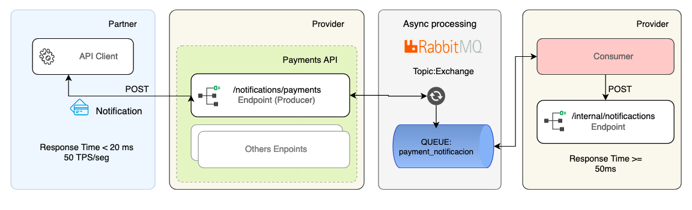
_Figura 1:_ Arquitectura de la solución usando RabbitMQ.

**Tecnologías que usaría** (Dentro del ecosistema de Java)

* Java 8+
* [Spring Boot 2.2.x](https://spring.io/projects/spring-boot)
* [Spring for rabbitMQ](https://spring.io/projects/spring-amqp)
* [Docker (Kubernetes) para levantar los clusters](https://www.docker.com/)
* [RabbitMQ](https://www.rabbitmq.com/)

**Código de ejemplo de un producer**
 Este sería el servicio que recibiría la primera notificación y la canalizaría a una cóla de mensajes para que los consumers las procesen. 

```java
// Se omiten las importaciones a drede.

@RestController
@RequestMapping(value = "/notifications/")
public class RabbitMQWebController {

    @Autowired
    RabbitMQSender rabbitMQSender;

    @GetMapping(value = "/producer")
    public String producer(@RequestBody PaymentNotification paymentNotification) {

         // Más Logica de negocio     
        rabbitMQSender.send(paymentNotification);

        return "OK"; //notificación tribial
    }

}
```

**Código de ejemplo de un Consumer**

Puede haber múltiples Consumidores desplegados y procesando los mensajes y llamadas a otras APIs.

```java
// Se omiten las importaciones

@Component
public class Consumer {

   @RabbitListener(queues = "${notifications.rabbitmq.queue}")
  public void receiveMessage(PaymentNotification paymentNotification) {
     //Se procesaria la llamada a otras APIs si tardan no importa porque se procesan de manera asincrona.
  }


}
```

**Otra propuesta**
Se pueden usar servicios mas avanzados dependiendo de la demanda de transacciones, en particular he trabajado con Cloud Pub/Sub de google y Kafka con Aiven.¡, o incluso algunas propuestas mas directas usando notificaciones Push como **Firebase** ó  **PubNub** un servicio especializado para notificaciones.

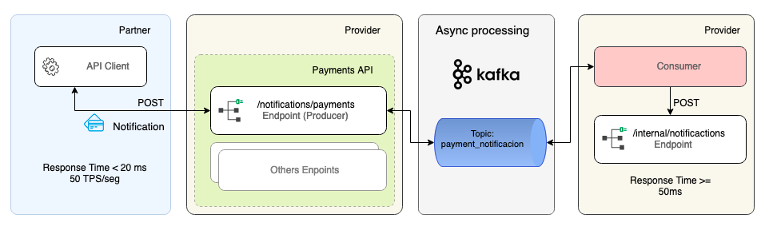

## Instrucciones para probar la solución.

### Ejecutar el proyecto

#### Pre-requisitos

* Contar con alguna distribución del JDK de Java correspondiente a la versión 1.8, para el desarrollo se usó [adoptOpenJDK 8](https://adoptopenjdk.net/)
  
  > Nota: No se usó otra versión de java porque a partir de la versión 9 los paquetes para el desarrollo de webservices Soap como xcf están deprecated.

* La herramienta [Maven instalada](https://maven.apache.org/install.html). 

#### Instrucciones para ejecución desde código fuente.

1. Desempaquetar el ZIP
2. Colocarse en la carpeta raíz.
3. Ejecutar lo siguiente`./mvnw spring-boot:run`
4. Seguir la instrcciones descritas en  **Pruebas con SoapUI** Que es una forma muy sencilla de probar aunque hay que instalar la herramienta.

#### Instrucciones para ejecución desde ejecutable

1. Desempaquetar el ZIP

2. Colocarse en la carpeta raíz.

3. Ejecutar lo siguiente `./mvnw clean package -DskipTests` ó  este otro`./mvnw clean package`Este último  incluirá la ejecución de pruebas unitarias.

4. Si la  última instrucción se ejecutó sin problemas se generó una carpeta `/target` donde contendrá el ejecutable.
   
   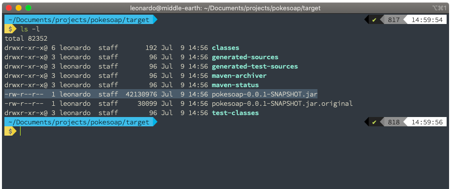

5. Entonces se podrá correr el  ejecutable con la siguiente instrucción `java -jar  pokesoap-0.0.1-SNAPSHOT.jar`

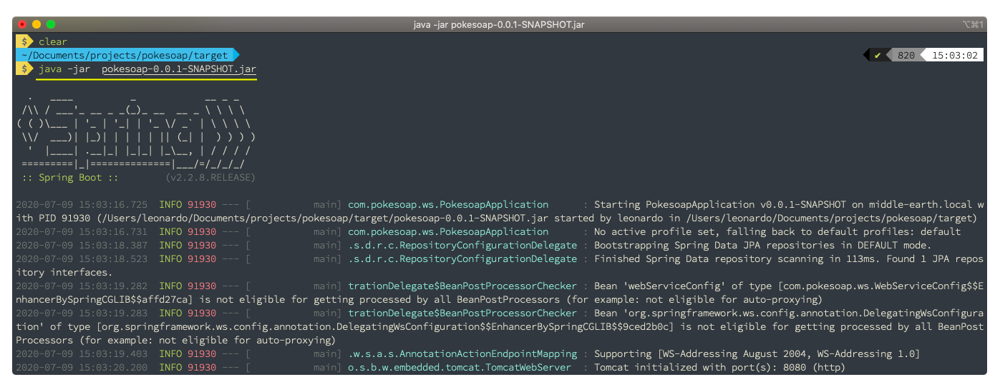

6. Seguir la instrucciones descritas en  **Pruebas con SoapUI** que es una forma muy sencilla de probar aunque hay que instalar la herramienta.

#### Instrucciones para ejecución con Docker

1. Desempaquetar el ZIP
2. Colocarse en la carpeta raíz
3. Para generar la imagen  `./mvnw dockerfile:build`

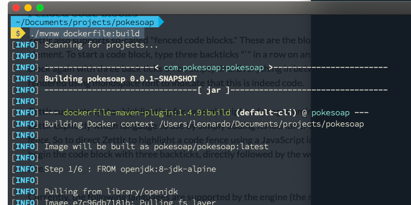

4. Si todo termina satisfactoriamente aproximadamente en 2 minutos.

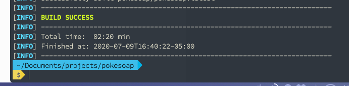

5. Verificar que se haya instalado la imagen con `docker images`.
   
   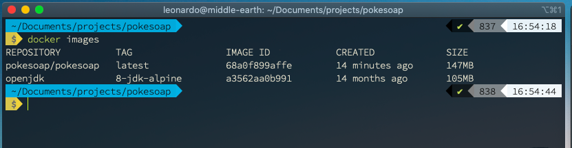

6. Levantamos el contenedor con `docker run -d -p 8080:8080 pokesoap/pokesoap:latest`

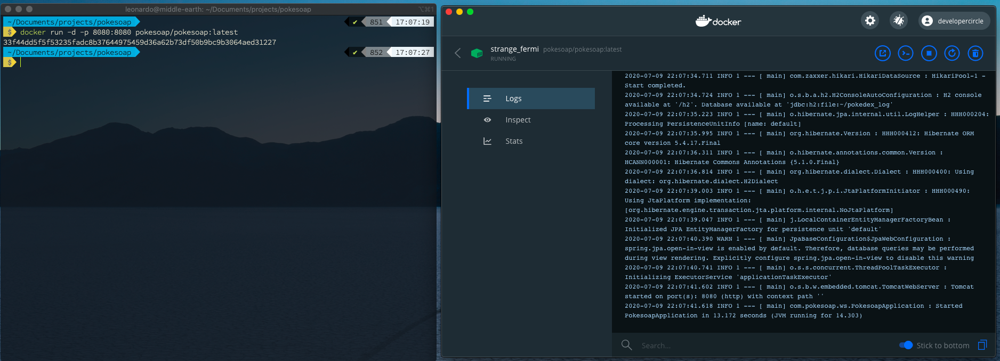

7. Continuar con las pruebas en la sección: **Pruebas con SoapUI**

#### Pruebas con SoapUI

* Se puede usar esta herramienta para hacer pruebas del servicio SOAP [https://www.soapui.org/downloads/soapui/  ](https://www.soapui.org/downloads/soapui/)
* La ruta del WSDL es:  http://localhost:8080/ws/pokemon.wsdl
* Con la ruta anterior se puede generar los Stubs para la prueba de consumo.
  
* Una vez generado los ejemplo de request, solo es cuestión de ejecutar 1 a 1 sustituyendo el parametro *name* por el nombre del pokemon del cual deseamos averiguar sus información.

```xml
<soapenv:Envelope xmlns:soapenv="http://schemas.xmlsoap.org/soap/envelope/" xmlns:mod="http://www.pokesoap.com/wsdl/model">
   <soapenv:Header/>
   <soapenv:Body>
      <mod:getAbilitiesRequest>
         <mod:name>charizard</mod:name>
      </mod:getAbilitiesRequest>
   </soapenv:Body>
</soapenv:Envelope>
```

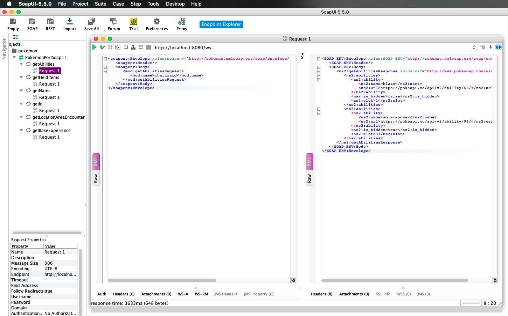

#### Verificar registro de solicitudes.

**Datos para acceder a la consola**

* **Consola h2:**[http://localhost:8080/h2](http://localhost:8080/h2]())
* **user:** ash
* **pass:** pueblo+paleta
* **DB URL:** jdbc:h2:file:~/pokedex_log

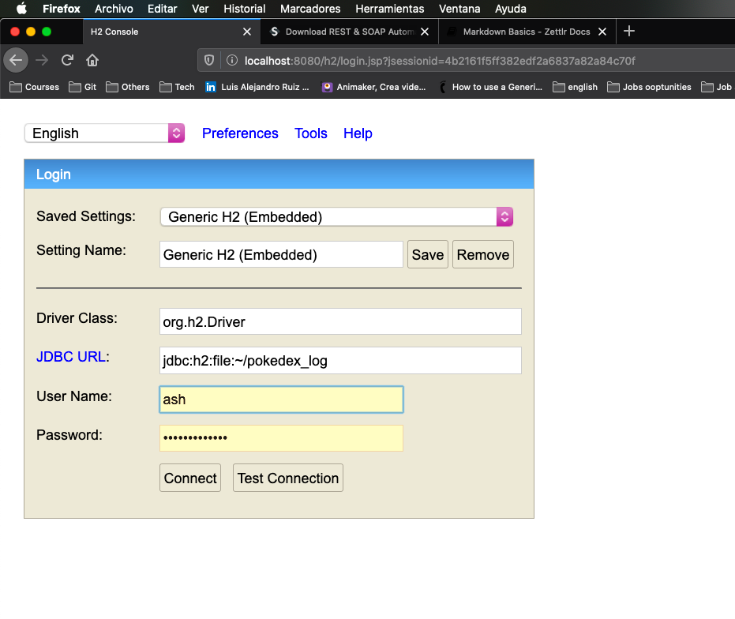

* Para realizar la consulta y verificar los registro solo intruducir la siguiente query y oprimir las teclas `CTRL+ENTER`

```sql
SELECT * FROM request_log;
```

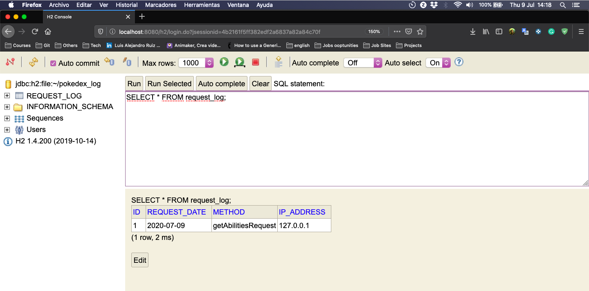

## Recursos utilizados

* Link de  trello para las actividades : [Tablero](https://trello.com/b/PMJMfP3v/personal)
* Para convertir en json schema https://jsonschema.net/home
* Para convertir de Json schema en Pojo http://www.jsonschema2pojo.org/ (Me sirvió a medias.)
* Para convertir de xml to xsd https://www.liquid-technologies.com/online-xml-to-xsd-converter  primero tuve que convertir de json data a xml.. con https://www.convertjson.com/json-to-xml.htm
